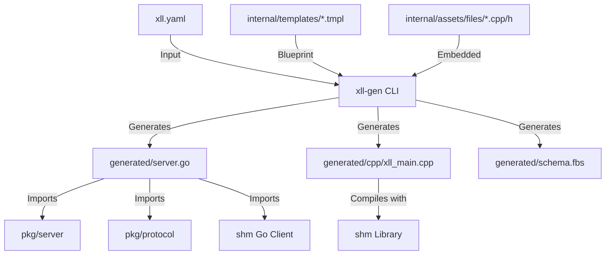

# xll-gen Design Document

## 1. Overview
`xll-gen` is a CLI tool designed to facilitate the creation of Excel Add-ins (XLL) using languages that are traditionally difficult to compile into DLLs or have runtime limitations in that context, such as Go.

### Core Philosophy
- **Language Agnostic Architecture**: Uses an out-of-process model. Excel (via a C++ shim) communicates with a standalone server process (e.g., written in Go) using Shared Memory.
- **Wails-like Experience**: Provides a seamless developer experience with commands like `init` and `build`. The complexity of C++ compilation and IPC is wrapped but remains transparent.
- **Non-Intrusive**: User logic resides in `main` code. The tool generates boilerplate in separate directories/packages that the user imports. Re-generation does not overwrite user logic.

## 2. Architecture

### Components
1.  **Excel Process**: Loads the generated XLL (C++).
2.  **XLL (C++ Shim)**:
    -   Auto-generated.
    -   Registers functions with Excel.
    -   Manages the lifecycle of the sidecar process (the User Server).
    -   Serializes Excel arguments to **Flatbuffers**.
    -   Writes to **Shared Memory** (`xll-gen/shm`).
    -   Signals the server and waits for a response.
3.  **User Server (Go)**:
    -   Standalone executable (embedded in XLL in `singlefile` mode).
    -   Uses generated IPC handling code.
    -   Listens on Shared Memory.
    -   Deserializes requests, routes them to the User's Implementation (Handler).
    -   Serializes responses and signals back to Excel.

### IPC Protocol
-   **Transport**: Shared Memory (Low latency, high throughput).
-   **Serialization**: Google Flatbuffers.
-   **Schema**: Dynamically generated based on user configuration.

## 2.1 System Protocol & Schema Pre-generation

To minimize generated code size and improve maintainability, the system-level FlatBuffers definitions (Chunking, Acks, Event responses, Grid types) are extracted into a static schema `pkg/protocol/protocol.fbs`.

**Schema Pre-generation Strategy:**
1.  **Static Protocol:** The `protocol.fbs` file is pre-compiled into the `github.com/xll-gen/xll-gen/pkg/protocol` Go package within the tool's repository. A corresponding C++ header `protocol_generated.h` is also pre-generated and shipped as an asset.
2.  **User Project Dependency:** Generated Go projects import `pkg/protocol` for system types (`protocol.Any`, `protocol.Grid`, etc.).
3.  **Schema Composition:** The user's `schema.fbs` (defining function requests/responses) uses `include "protocol.fbs"`.
4.  **Code Generation:** When `xll-gen generate` runs:
    -   It copies `protocol.fbs` to the user's `generated/` folder.
    -   It runs `flatc` for `schema.fbs`.
    -   It post-processes the generated Go code to replace local `protocol` imports with `github.com/xll-gen/xll-gen/pkg/protocol`.
    -   It skips generating C++ code for `protocol.fbs` (`--no-includes`), relying on the pre-generated `include/protocol_generated.h` asset.
    -   This prevents re-generation of static protocol code in the user's project.

**Benefits:**
-   **Reduced Bloat:** `server.go`, generated IPC code, and C++ sources are smaller.
-   **Centralized Logic:** Complex logic for chunking and batching resides in `pkg/server` (compiled library) rather than templates.
-   **Consistency:** All projects use the exact same protocol implementation.

## 3. Configuration (`xll.yaml`)

The project is defined by a `xll.yaml` file. This is the source of truth for code generation.

```yaml
project:
  name: "my-quant-lib"
  version: "0.1.0"

# Code generation settings
gen:
  go:
    package: "generated"

build:
  singlefile: xll
  temp_dir: "${TEMP}"

logging:
  level: info
  path: "server.log"

server:
  workers: 0
  timeout: "5s"
  launch:
    enabled: true
    # command: "${BIN}" # Default: Resolves to the server executable
    # cwd: "."          # Default: XLL directory (or Temp dir in singlefile)

# Function Definitions
functions:
  - name: "Add"
    description: "Adds two integers"
    args:
      - name: "a"
        type: "int"
        description: "First number"
      - name: "b"
        type: "int"
        description: "Second number"
    return: "int"
    volatile: false

  - name: "GetPrice"
    description: "Fetches price for a ticker"
    args:
      - name: "ticker"
        type: "string"
    return: "float"
    async: true  # Future support for async/calc
```

## 4. Project Structure

Running `xll-gen init` creates:

```text
my-project/
├── xll.yaml            # Configuration
├── main.go             # User entry point
├── go.mod
├── Taskfile.yml        # Build automation
├── generated/          # [DO NOT EDIT] Generated by xll-gen
│   ├── protocol.fbs    # Static System Schema (Copied)
│   ├── schema.fbs      # Generated Flatbuffers schema
│   ├── server.go       # Generated Go server logic
│   ├── interface.go    # Generated Go interface
│   ├── ipc/            # Generated Go types (Flatbuffers)
│   └── cpp/            # Generated C++ XLL source
│       ├── xll_main.cpp
│       ├── schema_generated.h
│       ├── CMakeLists.txt
│       └── include/    # Static C++ assets (Protocol, Utils, etc.)
└── build/              # Output directory
```

## 5. Developer Experience (CLI)

The CLI is written in Go and uses `cobra`.

### Commands

#### `init`
Scaffolds a new project.
```bash
xll-gen init my-project
```

#### `generate`
Reads `xll.yaml` and updates the `generated/` directory.
1.  Parses `xll.yaml`.
2.  Copies `protocol.fbs`.
3.  Generates `schema.fbs`.
4.  Runs `flatc` to generate Go serialization code (post-processed to import `pkg/protocol`).
5.  Runs `flatc` to generate C++ serialization code.
6.  Generates `interface.go` and `server.go`.
7.  Generates `xll_main.cpp`.

#### `build`
Wraps `task build` to compile the project.
1.  Runs `generate`.
2.  **Go Build**: Compiles `main.go` into a server binary.
3.  **C++ Build**: Compiles `generated/cpp` -> `build/my-project.xll`.
    -   In `singlefile: xll` mode, it uses Zstd to compress the Go binary and embeds it as a Windows resource.

#### `doctor`
Diagnoses the environment, specifically checking for the presence of a C++ compiler.
1. Checks for `cl.exe` (MSVC).
2. Checks for `g++` or `gcc` (MinGW).
3. If no compiler is found, it suggests installation via `winget`.
4. Checks for the presence of `flatc`. If missing, attempts to download the correct version.

## 6. Implementation Details

### User Code Integration (Go)

The user works in `main.go`. The CLI generates an interface in the generated package.

**Generated Interface (`generated/interface.go`):**
```go
package generated

import "github.com/xll-gen/xll-gen/pkg/protocol"

type XllService interface {
    Add(ctx context.Context, a int32, b int32) (int32, error)
    GetPrice(ctx context.Context, ticker string) (float64, error)
}

func Serve(handler XllService) {
    // IPC loop implementation
}
```

**User Main (`main.go`):**
```go
package main

import (
    "context"
    "my-project/generated"
)

type MyService struct{}

func (s *MyService) Add(ctx context.Context, a int32, b int32) (int32, error) {
    return a + b, nil
}

func (s *MyService) GetPrice(ctx context.Context, ticker string) (float64, error) {
    return 100.50, nil // Mock
}

func main() {
    // Connects to SHM and starts processing
    generated.Serve(&MyService{})
}
```

### C++ Generation Strategy
The C++ code must bridge Excel's `XLOPER12` types to Flatbuffers.
-   The generator creates a static C++ mapping based on types defined in `xll.yaml`.
-   Uses `xll-gen/shm` C++ library to write to the shared memory buffer.

### Build System
-   The CLI relies on `task` (Taskfile.dev) for build orchestration.
-   **Dependencies**:
    -   **Flatbuffers**: v25.9.23
    -   **SHM**: v0.5.4
    -   **Zstd**: v1.5.7 (For compression)
-   **Flatbuffers Compiler (`flatc`)**:
    -   The CLI automatically manages `flatc`.
    -   It detects the latest release from [Google Flatbuffers Releases](https://github.com/google/flatbuffers/releases).
    -   Downloads and caches the binary if not present on the system.
-   **C++ Compiler**:
    -   It must locate C++ compilers.
    -   Priority: MSVC (cl.exe) -> MinGW (g++) -> Clang.
    -   **Recommendation**: Users can easily install a compatible MinGW toolchain using `winget`:
        ```bash
        winget install -e --id BrechtSanders.WinLibs.POSIX.UCRT
        ```
-   Outputs explicit build steps to stdout for debugging/transparency.

## 7. Future Considerations
-   Support for Java/Node.js by adding `gen.java` or `gen.js` in `xll.yaml`.
-   Hot reloading (Go server restart without unloading XLL).
-   Async function support in Excel (handling long-running Go tasks).

## 8. Reference: Excel Internals

This section details the specific C API constructs used by the generated C++ code. It serves as the primary reference for agents generating registration and memory management logic.

### 8.1 xlfRegister & Data Types (`pxTypeText`)

When registering functions using `xlfRegister`, the `pxTypeText` string defines the return type and argument types. We exclusively use **XLOPER12** (Excel 2007+) types.

**Canonical Type Codes**
For types with multiple representation options, we stick to the following canonical choices to ensure consistency.

| Data Type | Code | C type | Description |
| :--- | :--- | :--- | :--- |
| **Boolean** | `A` | `short` | 0=false, 1=true. |
| **Double** | `B` | `double` | IEEE 8-byte floating point. |
| **Int** | `J` | `int32_t` | 32-bit signed integer. |
| **String** | `Q` | `XLOPER12 *` | Pointer to XLOPER12 (internally mapped to Q for safety). |
| **Array (FP)** | `K%` | `FP12 *` | Floating-point array structure. Efficient for math. |
| **Any (Value)** | `Q` | `XLOPER12 *` | Pointer to XLOPER12. Dereferences references (Pass by Value). |
| **Any (Ref)** | `U` | `XLOPER12 *` | Pointer to XLOPER12. Allows references (Range). |
| **Async** | `X` | `void *` | Async handle (Excel 2010+). |

**Strict Value Policy:**
We do **not** use optional/nullable scalar pointer types (e.g., `int?` -> `N` (int*), `float?` -> `E` (double*), `bool?` -> `L` (short*)).
*   **Reason**: Excel passes a valid pointer to a zero value (0, 0.0, false) for empty cells, making it impossible to distinguish between an explicit zero and a missing argument.
*   **Solution**: Users requiring optional inputs must use `any` (or `scalar`), which receives the raw `XLOPER12`. The generated code or user logic can then check `xltypeMissing` or empty variants.

**Nullable Returns:**
Nullable scalar returns (e.g., returning `int*` to represent `int` or `null`) are **strictly unsupported**.
*   **Reason**: Explicitly matching pointer types for returns adds unnecessary complexity to the generator.
*   **Rule**: Always use `any` (which maps to `AnyValue` in protocol) if you need to return `nil`/`null` from a function.

**Note**: Do not use the legacy 8-bit string types (`C`, `D`, `F`, `G`), `XLOPER` (`P`, `R`), or legacy `FP` (`K`). Always use the wide-char / `12` variants (e.g., `FP12` / `K%`).

**Thread Safety (`$`)**
Starting in Excel 2007, Excel can perform multithreaded workbook recalculation. Unless there is a specific reason to not support it, **all generated functions should be registered as thread-safe**.
To do this, append a `$` character to the end of the `pxTypeText` string.
*   Example: `QJJ$` (Returns Value, takes two Ints, Thread-Safe).

**Async Functions (`>...X`)**
For asynchronous functions (Excel 2010+), the registration string format changes:
1.  **Prefix**: The string must start with `>`.
2.  **Return Type**: The return type code is **omitted** (implied void).
3.  **Suffix**: The string must end with `X` (Async Handle).
*   Example: `>JJX` (Async function taking 2 Ints. The return type code is replaced by `>` and `X` is added at the end).

**Registration Arguments (Form 1)**
The generator implements `xlfRegister` (Form 1) fully, passing:
1.  `module_text` (DLL name)
2.  `procedure` (Export name)
3.  `type_text` (Type string, e.g., `QJJ$`)
4.  `function_text` (Function name)
5.  `argument_text` (Comma-separated argument names)
6.  `macro_type` (1 = Function)
7.  `category` (Default: Project Name)
8.  `shortcut_text` (Optional)
9.  `help_topic` (Optional)
10. `function_help` (Description)
11. `argument_help1` (Arg 1 Description)
...

### 8.2 Memory Management

Proper memory management is critical to prevent Excel crashes.

**Rules:**
1.  **Inputs are Read-Only**: Arguments passed to the XLL function must never be freed or modified.
2.  **Returning DLL-Allocated Memory**: When the XLL returns an `XLOPER12` that points to memory allocated by the DLL (e.g., a string):
    -   Set `xltype` to `type | xlbitDLLFree`.
    -   Implement the `xlAutoFree12` callback.
    -   Use the provided `xll_mem` library helpers (`NewExcelString`, `NewXLOPER12`) which use a thread-safe object pool and `xlAutoFree12` implementation.
3.  **Strings**: We use `Q` for string inputs (XLOPER12) to ensure safety. For returns, we use `Q` (XLOPER12) wrapping a counted wide string with `xlbitDLLFree`.


### 8.3 Error Codes (`xlCVError`)

When returning errors from the XLL (e.g., if the Go server is unreachable), return an `XLOPER12` with `xltype = xltypeErr` and one of the following integer codes.

| Error Name | Value | Description |
| :--- | :--- | :--- |
| `xlErrNull` | `2000` | Null intersection |
| `xlErrDiv0` | `2007` | Division by zero |
| `xlErrValue` | `2015` | Invalid value |
| `xlErrRef` | `2023` | Invalid reference |
| `xlErrName` | `2029` | Invalid name |
| `xlErrNum` | `2036` | Invalid number |
| `xlErrNA` | `2042` | Value not available |
| `xlErrGettingData` | `2043` | Getting Data (Async) |
| `xlErrSpill` | `2045` | Spill error |
| `xlErrConnect` | `2046` | Connection error |
| `xlErrBlocked` | `2047` | Blocked error |
| `xlErrUnknown` | `2048` | Unknown error |
| `xlErrField` | `2049` | Field error |
| `xlErrCalc` | `2050` | Calculation error |

### 8.4 Event Handlers

Starting with Excel 2010, `xlEventRegister` allows XLLs to register for specific system events, primarily to manage the lifecycle of asynchronous user-defined functions (UDFs).

**Supported Events:**
*   `CalculationEnded` (Code 1): Raised when Excel completes a calculation cycle. Useful for freeing resources allocated during async calculations.
*   `CalculationCanceled` (Code 2): Raised when the user interrupts the calculation (e.g., via ESC). The XLL should abort pending async activities. **Immediately following this event, the `CalculationEnded` event is raised.**

**Note**: `CalculationEnded` and `CalculationCanceled` are **not** raised during programmatic recalculation.

**Configuration (`xll.yaml`):**
```yaml
events:
  - type: "CalculationEnded"
    name: "OnCalculationEnded"
```
This generates a corresponding C++ handler that forwards the event to the Go server.

**Command Scheduling**:
The Go server allows scheduling Excel commands to be executed by the C++ XLL during the `CalculationEnded` event.
*   The Go server maintains a queue of commands (`ScheduleSet`, `ScheduleFormat`).
*   When `CalculationEnded` is triggered, the Go server serializes these commands into the response.
*   The C++ XLL receives the response and executes the commands using `xlSet` and `xlcFormatNumber`.

### 8.5 Caller Information & Number Format

To access the cell that called the function (e.g., for formatting awareness), use `xlfCaller`.

**Retrieving Caller:**
*   Call `xlfCaller`.
*   Result is a Reference (`xltypeRef` or `xltypeSRef`).

**Retrieving Number Format:**
To get the number format of the caller (e.g., to preserve it or use it):
*   Call `xlfGetCell` with type `7`.
*   Result is a string (e.g., "General", "0.00").

**References:**
*   [xlfCaller](https://learn.microsoft.com/en-us/office/client-developer/excel/xlfcaller)
*   [GET.CELL (Type 7)](https://xlladdins.github.io/Excel4Macros/get.cell.html)
*   [Excel C API Programming](https://learn.microsoft.com/en-us/office/client-developer/excel/programming-with-the-c-api-in-excel)

## 9. Reference: Shared Memory (IPC)

The `xll-gen/shm` library provides low-latency IPC. For maximum performance, we use **Zero-Copy** operations where possible, especially for FlatBuffers.

### 9.1 Zero-Copy (C++ Host)

Instead of building a FlatBuffer on the heap and copying it to the shared memory slot, we construct it directly in the slot's request buffer.

```cpp
// 1. Acquire a Zero-Copy Slot
auto slot = host.GetZeroCopySlot();

// 2. Build FlatBuffer directly in shared memory
// slot.GetReqBuffer() returns the pointer to the buffer.
// We pass it to the builder as the initial buffer.
flatbuffers::FlatBufferBuilder builder(
    slot.GetMaxReqSize(),
    nullptr,
    false,
    slot.GetReqBuffer()
);

// ... build your object ...
// auto offset = CreateMyRequest(builder, ...);
// builder.Finish(offset);

// 3. Send Request
// Signals MSG_ID_FLATBUFFER (or user ID) and handles size internally.
slot.SendFlatBuffer(builder.GetSize());

// 4. Access Response Directly (Zero-Copy)
// The response is available in the response buffer immediately after Send returns.
uint8_t* respData = slot.GetRespBuffer();
int32_t respSize = slot.GetRespSize();
```

### 9.2 Zero-Copy (Go Guest)

The Go client handler receives a slice that points directly to the shared memory region. Reading from `req` is zero-copy.

```go
client.Handle(func(req []byte, respBuf []byte, msgId uint32) int32 {
    // 'req' points to the shared memory slot payload.
    // It is safe to read directly (e.g., using FlatBuffers GetRootAs...).

    if msgId == shm.MsgIdFlatbuffer {
        // processFlatBuffer(req)
    }

    // Write response to respBuf
    // ...
    return bytesWritten
})
```

## 10. Agent Guidelines

*   **Documentation Updates**: When modifying features or adding new capabilities, you must update the relevant documentation (e.g., `README.md`, `AGENTS.md`) to reflect the changes.
*   **Language Policy**: All documentation, code comments, commit messages, and other project-related text must be in English.
*   **Versioning**: The version of `xll-gen` is defined in `version/version.go`. All generated files (C++, Go, CMake, etc.) must include a header comment indicating the version of `xll-gen` that created them. This helps in debugging and ensures users know when their artifacts are out of date.
*   **Testing**: When applying changes due to upstream library updates (e.g., `shm` API changes), ensure that any outdated or incompatible tests are updated or deleted if they are no longer relevant.
*   **Conflict Resolution**: Before committing or submitting changes, always check for conflicts with the `main` branch and resolve them.
*   **Code Comments**: Remove verbose comments that are unnecessary because the code is self-explanatory. Comments should focus on explaining the "why" or complex logic, rather than restating what the code does.

## 11. Development Workflow

*   **Temporary Projects**: Use directories starting with `temp_` (e.g., `temp_verify`, `temp_test`) for creating temporary test projects. These are git-ignored to prevent accidental commits of artifacts.

## 12. Tag Message Guidelines

When creating a tag message, adhere to the following format:

1.  **Major Changes Summary**: Group major changes by category (e.g., Performance, Feature, Fix). Summarize the change and include the commit hash.
2.  **Detailed Commit List**: List all commits (including those not in the summary) with their commit message and hash.
3.  **Hyperlinks**: Ensure every commit hash is a hyperlink.

**Example:**

```text
### Features
* Added async support ([1a2b3c](http://url...))

### Performance
* Optimized IPC ([4d5e6f](http://url...))

### All Commits
* [1a2b3c](http://url...) Added async support
* [4d5e6f](http://url...) Optimized IPC
* [7g8h9i](http://url...) Fixed typo in README
```

## 13. Reference: Optional & Variable Arguments

This section describes how to handle **Optional Arguments** and **Variable Arguments** in Excel XLL development.

Since the Excel C API does not support variable arguments like C's `va_list`, the standard approach is **"Accept pointers up to a maximum count and check for `xltypeMissing`"**.

### 13.1 Core Mechanism

*   **Register Types**: Always use `P`, `Q`, or `U` (`XLOPER12` variants). Never use scalar types (`B`, `J`) as they cannot represent "missing".
*   **Check Missing**: In C++, check `arg->xltype == xltypeMissing` to identify omitted arguments.
*   **UI Hint**: Use brackets `[Name]` in `xlfRegister`'s argument text to indicate optionality to the user.

### 13.2 Optional Arguments Example

**Scenario:** `CalcWithOption(Value, [Multiplier])` where `Multiplier` defaults to 1.0.

```cpp
// C++: Check for xltypeMissing
extern "C" __declspec(dllexport) LPXLOPER12 WINAPI CalcWithOption(LPXLOPER12 pxVal, LPXLOPER12 pxMul) {
    // ...
    double multiplier = 1.0; // Default
    if (pxMul->xltype != xltypeMissing) {
        // Coerce/Read pxMul if present
    }
    // ...
}
```

```cpp
// Register: Note "QQQ" and "[Multiplier]"
Excel12(xlfRegister, 0, 10, ..., TempStr12(L"QQQ"), TempStr12(L"Value, [Multiplier]"), ...);
```

### 13.3 Variable Arguments Example

**Scenario:** `MySum(v1, [v2], ... [v10])`. Define a max count (Sparse Arguments).

```cpp
#define MAX_ARGS 10
extern "C" __declspec(dllexport) LPXLOPER12 WINAPI MySum(LPXLOPER12 p1, ..., LPXLOPER12 p10) {
    LPXLOPER12 args[MAX_ARGS] = { p1, ..., p10 };
    for (int i = 0; i < MAX_ARGS; i++) {
        if (args[i]->xltype == xltypeMissing) continue; // Skip
        // Process args[i]
    }
    // ...
}
```

**Recommendation:** If you need more than 10-20 arguments, accept a single `Range` (`U`) or `Array` (`Q`) instead. It's cleaner to loop over `xltypeMulti` in C++ than to register 30 arguments.

## 14. Architecture & Dependency Graph

When modifying the system, understand the ripple effects using this map:



### Critical: Synchronized Updates
**The components shown above are tightly coupled.** When a shared dependency (like `shm` or `protocol`) is updated, **all** related parts (`xll.yaml` schema logic, C++ assets, Go templates, and Go packages) must be updated synchronously to maintain compatibility. Partial updates will break the system.

### Change Propagation Rules

Use this guide to understand what needs to be updated when you make a change in a specific area.

| If you change... | You must also... |
| :--- | :--- |
| **`xll.yaml`** | Run `xll-gen generate` in the user project. |
| **`internal/templates/*.tmpl`** | 1. Rebuild `xll-gen` (or run `go install .`).<br>2. Run `xll-gen generate` in the user project to see changes. |
| **`internal/assets/files/*`** | 1. Rebuild `xll-gen` (assets are embedded).<br>2. Run `xll-gen generate` in the user project (overwrites C++ files). |
| **`pkg/protocol`** | 1. Update `internal/templates/protocol.fbs` if the FlatBuffers schema changed.<br>2. Rebuild `xll-gen`.<br>3. Run `xll-gen generate`. |
| **`pkg/server`** | 1. Update `server.go.tmpl` if the API used by the generated code changes.<br>2. Rebuild `xll-gen` (if template changed).<br>3. Run `go get -u github.com/xll-gen/xll-gen/pkg/server` in the user project (or replace directive in tests). |
| **`shm` Library** | 1. Update `go.mod` in `xll-gen`.<br>2. Update `GIT_TAG` in `internal/templates/CMakeLists.txt.tmpl`.<br>3. Update C++ assets (`xll_ipc.cpp`, etc.) if C++ API changed.<br>4. Update Go assets (`pkg/server`, templates) if Go API changed. |

## 15. Reference: Async UDF & RTD

This section provides external references for implementing and understanding Async UDF (native async) and RTD (Real-Time Data) in XLL.

### Async UDF (XLL, native)
*   **Asynchronous user-defined functions** (Concept, Signature, Flow, `xlAsyncReturn`): [Microsoft Learn](https://learn.microsoft.com/en-us/office/client-developer/excel/asynchronous-user-defined-functions)
*   **xlAsyncReturn** (Callback restrictions, Signature): [Microsoft Learn](https://learn.microsoft.com/en-us/office/client-developer/excel/xlasyncreturn)
*   **Programming with the C API in Excel** (Context for Excel12/Excel4 callbacks): [Microsoft Learn](https://learn.microsoft.com/en-us/office/client-developer/excel/programming-with-the-c-api-in-excel)
*   **C API Functions that can be called only from a DLL or XLL** (Scope of callbacks): [Microsoft Learn](https://learn.microsoft.com/en-us/office/client-developer/excel/c-api-functions-that-can-be-called-only-from-a-dll-or-xll)

### RTD (Excel Side)
*   **RTD function** (Worksheet usage): [Microsoft Support](https://support.microsoft.com/ko-kr/office/rtd-%ED%95%A8%EC%88%98-e0cc001a-56f0-470a-9b19-9455dc0eb593)
*   **RTD object (Excel)** (VBA/COM Object Model): [Microsoft Learn](https://learn.microsoft.com/en-us/office/vba/api/excel.rtd)

### Implementation Guides & Samples
*   **Excel-DNA: Excel C API Guide** (Overview): [Excel-DNA Docs](https://excel-dna.github.io/docs/guides-basic/excel-programming-interfaces/excel-c-api/)
*   **Excel-DNA Google Group** (Discussions on async/native async): [Google Groups](https://groups.google.com/g/exceldna/c/njGaROmQLzI)
